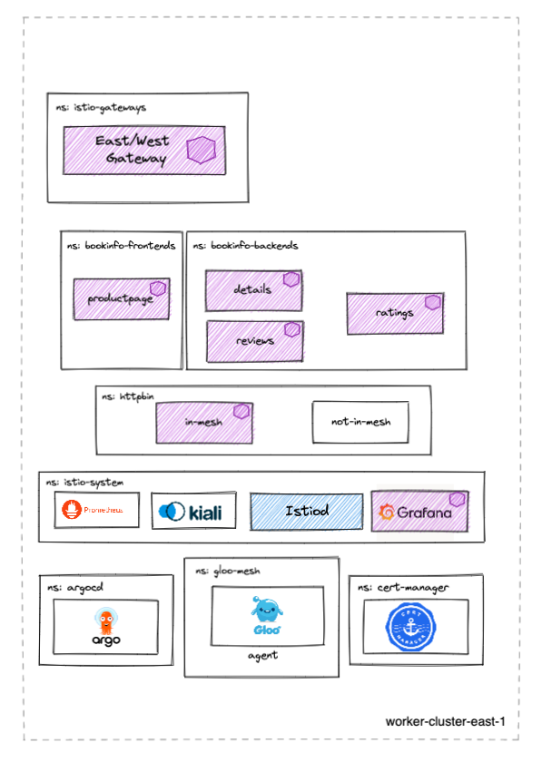

# gloo-mesh-demo-aoa

## version 2.0.9
This repo provides a multitenant capable GitOps workflow structure that can be forked and used to demonstrate the deployment and configuration of a multi-cluster mesh demo as code using the Argo CD app-of-apps pattern.

This repo is meant to be deployed along with the following repos to create the entire High Level Architecture diagram below.
- https://github.com/ably77/aoa-mgmt
- https://github.com/ably77/aoa-cluster1

# Prerequisites 
- mgmt cluster deployed with gloo mesh installed. start with link above if needed
- Additional Kubernetes Cluster
    - This demo has been tested on 1x `n2-standard-4` (gke), `m5.xlarge` (aws), or `Standard_DS3_v2` (azure) instance for `cluster2` cluster

# High Level Architecture


# What this repo deploys


## Notable Differences
- `cluster2` does not have a North/South Ingress Gateway, all traffic to services in this cluster are accessed through the East/West gateway
- `cluster2` does not have the gloo-mesh-addons deployed

# Getting Started
Run:
```
./deploy.sh           # deploys on cluster2 cluster
```

Note:
- By default, the script expects to deploy into a cluster context named `cluster2`
- Context parameters can be changed from defaults by changing the variables in the `deploy.sh` script. A check is done to ensure that the defined contexts exist before proceeding with the installation. Note that the character `_` is an invalid value if you are replacing default contexts
- Although you may change the contexts where apps are deployed as describe above, the Gloo Mesh and Istio cluster names will remain stable references (i.e. `cluster2`, `cluster2`, and `cluster2`)

# App of Apps Explained
The app-of-apps pattern uses a generic Argo Application to sync all manifests in a particular Git directory, rather than directly point to a Kustomize, YAML, or Helm configuration. Anything pushed into the `environment/<overlay>/active` directory is deployed by it's corresponding app-of-app
```
environment
├── apps
│   ├── active
│   │   ├── bookinfo-backends-dyaml.yaml
│   │   ├── bookinfo-frontends-dyaml.yaml
│   │   └── httpbin-in-mesh.yaml
│   ├── apps-aoa.yaml
├── cluster-config
│   ├── active
│   │   ├── bookinfo-backends-ns.yaml
│   │   ├── bookinfo-frontends-ns.yaml
│   │   ├── cert-manager-cacerts.yaml
│   │   ├── cert-manager-ns.yaml
│   │   ├── cert-manager.yaml
│   │   ├── gloo-mesh-ns.yaml
│   │   ├── httpbin-ns.yaml
│   │   ├── httpbin-oidc-client-secret.yaml
│   │   ├── istio-gateways-ns.yaml
│   │   ├── istio-system-ns.yaml
│   │   ├── relay-identity-token-secret.yaml
│   │   └── relay-root-ca.yaml
│   ├── cluster-config-aoa.yaml
└── infra
    ├── active
    │   ├── agent-cert.yaml
    │   ├── clusterissuer.yaml
    │   ├── grafana.yaml
    │   ├── issuer.yaml
    │   ├── istio-base.yaml
    │   ├── istio-eastwestgateway.yaml
    │   ├── istiod-1-13.yaml
    │   ├── kiali.yaml
    │   └── prometheus.yaml
    ├── infra-aoa.yaml
```

# forking this repo
Fork this repo and run the script below to your GitHub username if owning the control over pushing/pulling into the repo is desirable
```
cd tools/
./replace-github-username.sh <github_username>
```
Now you can push new manifests into the corresponding `environments` directories in your fork to sync them using Argo CD
