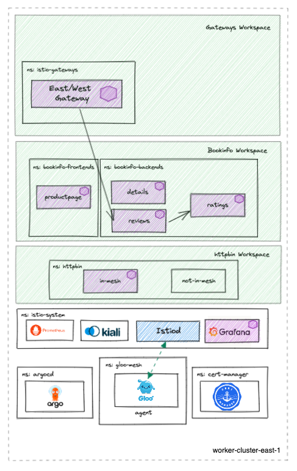

# aoa-cluster2
This repo provides a multitenant capable GitOps workflow structure that can be forked and used to demonstrate the deployment and configuration of a multi-cluster mesh demo as code using the Argo CD app-of-apps pattern.

# versions
- prod:
    - gloo mesh 2.1.0-beta27
    - istio 1.13.4
    - revision: 1-13
- qa:
    - gloo mesh 2.1.0-beta27
    - istio 1.14.3
    - revision: 1-14
- dev:
    - gloo mesh 2.1.0-beta27
    - istio 1.15.0
    - revision: 1-15

# Prerequisites 
- mgmt cluster deployed with gloo mesh installed. start with link above if needed
- 1 Kubernetes Cluster
    - This demo has been tested on 1x `n2-standard-4` (gke), `m5.xlarge` (aws), or `Standard_DS3_v2` (azure) instance for `mgmt` cluster

This repo is meant to be deployed along with the following repos to create the entire High Level Architecture diagram below.
- https://github.com/ably77/aoa-mgmt
- https://github.com/ably77/aoa-cluster2

# High Level Architecture


# What this repo deploys


# Getting Started
Run:
```
./deploy.sh $gloo_mesh_version $environment_overlay $cluster_context
```

Note:
- - The script will prompt you for the gloo mesh version and environment overlay if not provided.
- By default, the script will deploy into a cluster context named `cluster2`if not passed in
- Context parameters can be changed from defaults by passing in variables in the `deploy.sh` A check is done to ensure that the defined contexts exist before proceeding with the installation. Note that the character `_` is an invalid value if you are replacing default contexts
- Although you may change the contexts where apps are deployed as describe above, the Gloo Mesh and Istio cluster names will remain stable references (i.e. `mgmt`, `cluster1`, and `cluster2`)

# App of Apps Explained
The app-of-apps pattern uses a generic Argo Application to sync all manifests in a particular Git directory, rather than directly point to a Kustomize, YAML, or Helm configuration. Anything pushed into the `environment/<overlay>/active` directory is deployed by it's corresponding app-of-app
```
environment
├── wave-1-clusterconfig
│   ├── base
│   │   └── active
│   │       ├── bookinfo-backends-ns.yaml
│   │       ├── bookinfo-frontends-ns.yaml
│   │       ├── cert-manager-ns.yaml
│   │       ├── gloo-mesh-addons-ns.yaml
│   │       ├── gloo-mesh-ns.yaml
│   │       ├── httpbin-ns.yaml
│   │       ├── httpbin-oidc-client-secret.yaml
│   │       ├── istio-gateways-ns.yaml
│   │       ├── istio-system-ns.yaml
│   │       ├── kustomization.yaml
│   │       ├── relay-identity-token-secret.yaml
│   │       └── relay-root-ca.yaml
│   ├── dev
│   │   └── active
│   │       └── kustomization.yaml
│   ├── init.sh
│   ├── prod
│   │   └── active
│   │       └── kustomization.yaml
│   ├── qa
│   │   └── active
│   │       └── kustomization.yaml
│   └── test.sh
├── wave-2-certmanager
│   ├── base
│   │   └── active
│   │       ├── cert-manager-cacerts.yaml
│   │       ├── cert-manager.yaml
│   │       └── kustomization.yaml
│   ├── dev
│   │   └── active
│   │       └── kustomization.yaml
│   ├── init.sh
│   ├── prod
│   │   └── active
│   │       └── kustomization.yaml
│   ├── qa
│   │   └── active
│   │       └── kustomization.yaml
│   └── test.sh
├── wave-3-istio
│   ├── base
│   │   ├── active
│   │   │   ├── grafana.yaml
│   │   │   ├── istio-base.yaml
│   │   │   ├── istio-eastwestgateway.yaml
│   │   │   ├── istiod.yaml
│   │   │   ├── kiali.yaml
│   │   │   ├── kustomization.yaml
│   │   │   ├── prometheus.yaml
│   │   │   └── tls-secret-cert.yaml
│   │   └── non-active
│   │       └── istio-ingressgateway.yaml
│   ├── dev
│   │   └── active
│   │       ├── kustomization.yaml
│   │       └── patches
│   │           ├── grafana-1-15.yaml
│   │           ├── istio-base-1.15.0.yaml
│   │           ├── istio-ingressgateway-1.15.0.yaml
│   │           └── istiod-1.15.0.yaml
│   ├── init.sh
│   ├── prod
│   │   └── active
│   │       └── kustomization.yaml
│   ├── qa
│   │   └── active
│   │       ├── kustomization.yaml
│   │       └── patches
│   │           ├── grafana-1.14.3.yaml
│   │           ├── istio-base-1.14.3.yaml
│   │           ├── istio-ingressgateway-1.14.3.yaml
│   │           └── istiod-1.14.3.yaml
│   └── test.sh
├── wave-4-gloo-mesh
│   ├── base
│   │   └── active
│   │       ├── agent-cert.yaml
│   │       ├── clusterissuer.yaml
│   │       ├── gloo-mesh-crds.yaml
│   │       ├── issuer.yaml
│   │       └── kustomization.yaml
│   ├── dev
│   │   └── active
│   │       └── kustomization.yaml
│   ├── init.sh
│   ├── prod
│   │   └── active
│   │       └── kustomization.yaml
│   ├── qa
│   │   └── active
│   │       └── kustomization.yaml
│   └── test.sh
├── wave-5-bookinfo
│   ├── base
│   │   ├── active
│   │   │   ├── bookinfo-backends-dyaml.yaml
│   │   │   ├── bookinfo-frontends-dyaml.yaml
│   │   │   └── kustomization.yaml
│   │   └── non-active
│   │       └── bookinfo-cert.yaml
│   ├── dev
│   │   └── active
│   │       └── kustomization.yaml
│   ├── init.sh
│   ├── prod
│   │   └── active
│   │       └── kustomization.yaml
│   ├── qa
│   │   └── active
│   │       └── kustomization.yaml
│   └── test.sh
└── wave-6-httpbin
    ├── base
    │   ├── active
    │   │   ├── httpbin-in-mesh.yaml
    │   │   ├── httpbin-not-in-mesh.yaml
    │   │   └── kustomization.yaml
    │   └── non-active
    │       └── bookinfo-cert.yaml
    ├── dev
    │   └── active
    │       └── kustomization.yaml
    ├── init.sh
    ├── prod
    │   └── active
    │       └── kustomization.yaml
    ├── qa
    │   └── active
    │       └── kustomization.yaml
    └── test.sh
```

# forking this repo
Fork this repo and modify the variables in the `tools/configure-wave.sh` script to point to your own github username, repo name, and branch
```
wave_name=${1:-""}
environment_overlay=${2:-prod} # prod, qa, dev, base
cluster_context=${3:-mgmt}
github_username=${4:-ably77}
repo_name=${5:-aoa-mgmt}
target_branch=${6:-HEAD}
```

Now you can should be able to deploy and sync the corresponding `environment` waves in your fork and push new changes to it
